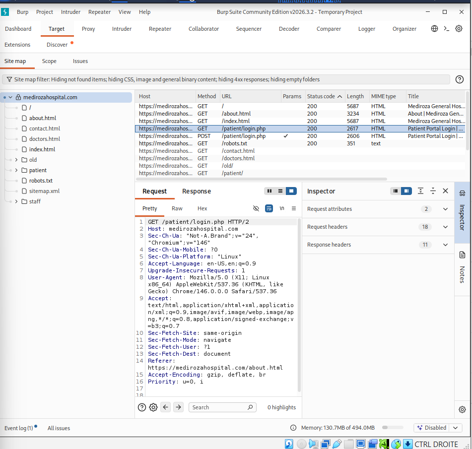
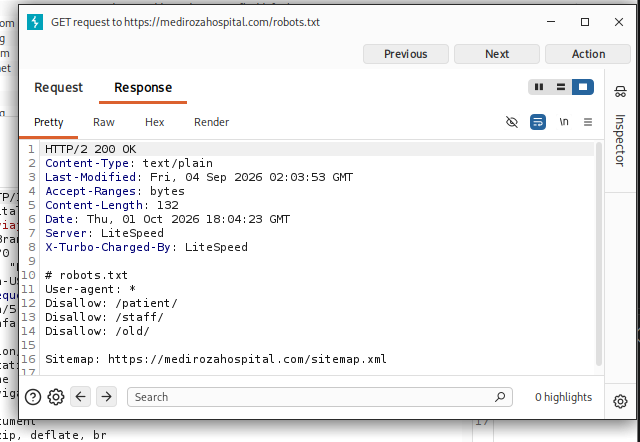
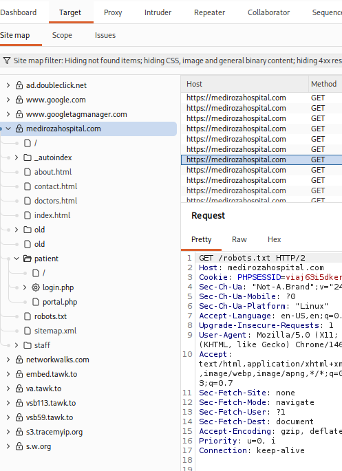
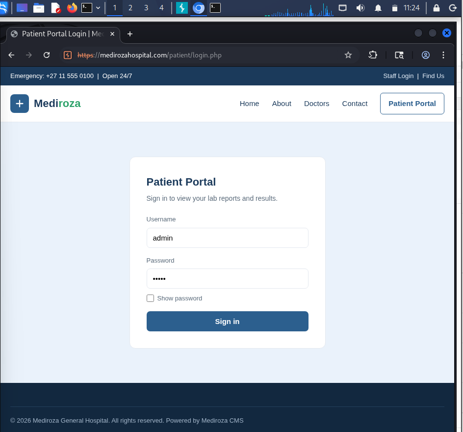
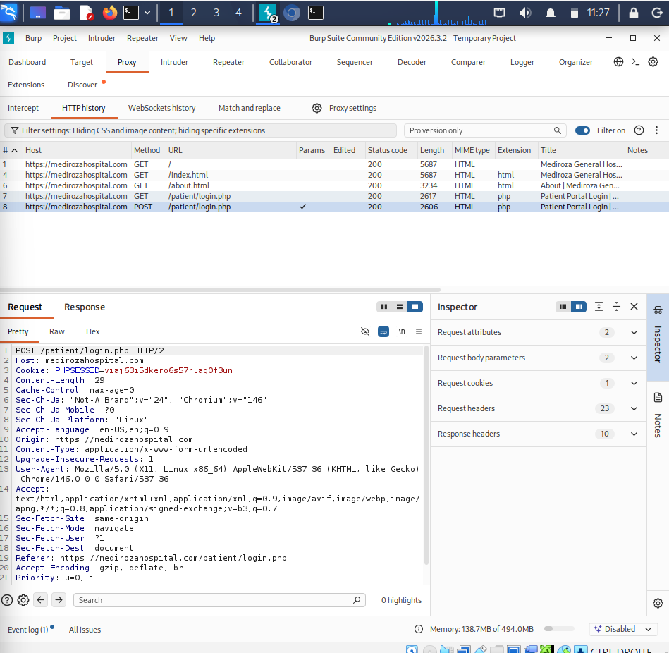
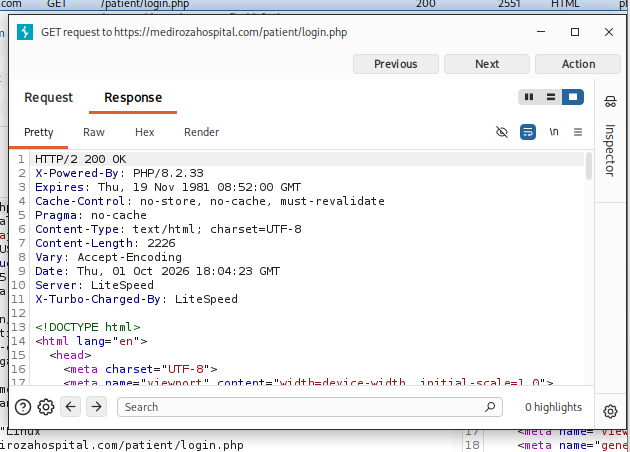
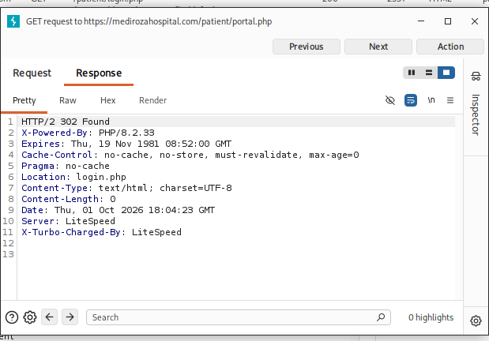

# M1 — INITIAL ACCESS

## 1. Objective

The objective of this milestone was to assess the publicly exposed attack surface of the Mediroza General Hospital web application and obtain authorized access to the patient area in order to retrieve the three confidential PDF laboratory reports specified by the laboratory scenario.

---

## 2. Target Information

| Parameter       | Details                                       |
| --------------- | --------------------------------------------- |
| Target          | `https://medirozahospital.com`                |
| Assessment Type | Black-Box Web Application Penetration Testing |
| Environment     | Authorized Educational Lab                    |
| Milestone       | M1 — Initial Access                           |

---

# 3. Reconnaissance

The assessment started with reconnaissance of the target application using Burp Suite.

The objective was to identify publicly accessible resources, application directories and potential entry points.

---

## 3.1 Target Identification

The target application was accessed and added to the Burp Suite assessment scope.

### Evidence



**Figure 1 — Target application identified in Burp Suite**

---

## 3.2 robots.txt Analysis

The `robots.txt` file was inspected to identify paths referenced by the web application.

The following resources were identified:

```text
/old/
/patient/
/robots.txt
/sitemap
/staff/
```

### Evidence



**Figure 2 — Exposed application paths identified through robots.txt**

---

## 3.3 Patient Directory Discovery

The `/patient/` directory was then accessed.

The directory listing revealed several application resources:

```text
reports/
download.php
error_log
login.php
logout.php
portal.php
```

These resources provided information about the patient authentication and report-management functionality.

### Evidence



**Figure 3 — Patient directory and exposed application resources**

---

# 4. Authentication Analysis

## 4.1 Patient Login Page

The patient authentication interface was identified at:

```text
/patient/login.php
```

The login page was analyzed to understand the application's authentication workflow.

### Evidence



**Figure 4 — Patient authentication interface**

---

## 4.2 Login Request

Burp Suite was used to intercept the HTTP request generated by the authentication form.

The request was analyzed to identify:

* HTTP method;
* authentication endpoint;
* submitted parameters;
* session-related information;
* server response.

### Evidence



**Figure 5 — HTTP authentication request intercepted with Burp Suite**

---

## 4.3 Login Response

The corresponding server response was analyzed to determine how the application handled the authentication attempt.

### Evidence



**Figure 6 — Server response to the authentication request**

---

# 5. Authentication Protection

Direct access to the patient portal was tested without an authenticated session.

The application redirected the unauthenticated request to the login page, demonstrating that the patient portal was protected by an authentication mechanism.

### Evidence



**Figure 7 — Authentication protection of the patient portal**

The `/patient/reports/` resource was also tested without authentication and returned:

```text
403 Forbidden
```

This result was recorded as part of the access-control analysis.

---

# 6. Authorized Access

Credentials provided by the authorized laboratory scenario were subsequently used to authenticate to the patient portal.

After successful authentication, access to the patient area and report functionality was obtained.

For security reasons, credentials and session tokens are not included in this repository.

---

# 7. Report Retrieval

After authentication, the report-download functionality was identified.

The three PDF laboratory reports specified in the M1 scenario were successfully retrieved.

The original documents are **not included in this public repository** because they may contain confidential medical and personally identifiable information.

The files were retained locally as evidence and subsequently used during **M2 — Data Extraction**.

---

# 8. M1 Evidence Summary

| #  | Evidence                                  | Purpose                                    |
| -- | ----------------------------------------- | ------------------------------------------ |
| 01 | `01-target.png`                           | Target identification                      |
| 02 | `02-robots-txt.png`                       | Discovery of exposed paths                 |
| 03 | `03-patient-directory.png`                | Discovery of patient resources             |
| 04 | `04-login-page.png`                       | Identification of authentication interface |
| 05 | `05-login-request.png`                    | Analysis of authentication request         |
| 06 | `06-login-response.png`                   | Analysis of authentication response        |
| 07 | `07-portal-authentication-protection.png` | Verification of portal access control      |

---

# 9. Screenshots Directory

All screenshots associated with this milestone are stored in:

```text
M1-INITIAL-ACCESS/
└── screenshots/
    ├── 01-target.png
    ├── 02-robots-txt.png
    ├── 03-patient-directory.png
    ├── 04-login-page.png
    ├── 05-login-request.png
    ├── 06-login-response.png
    └── 07-portal-authentication-protection.png
```

The screenshots provide visual evidence supporting the reconnaissance and authentication analysis described in this milestone.

---

# 10. Result

### ✅ M1 — INITIAL ACCESS COMPLETED

The following objectives were achieved:

* [x] Target identified
* [x] Attack surface partially enumerated
* [x] Patient directory identified
* [x] Authentication interface identified
* [x] Authentication traffic analyzed
* [x] Access-control behavior verified
* [x] Authorized authentication performed
* [x] Three laboratory PDF reports retrieved

The retrieved documents were subsequently analyzed during:

**M2 — DATA EXTRACTION**
