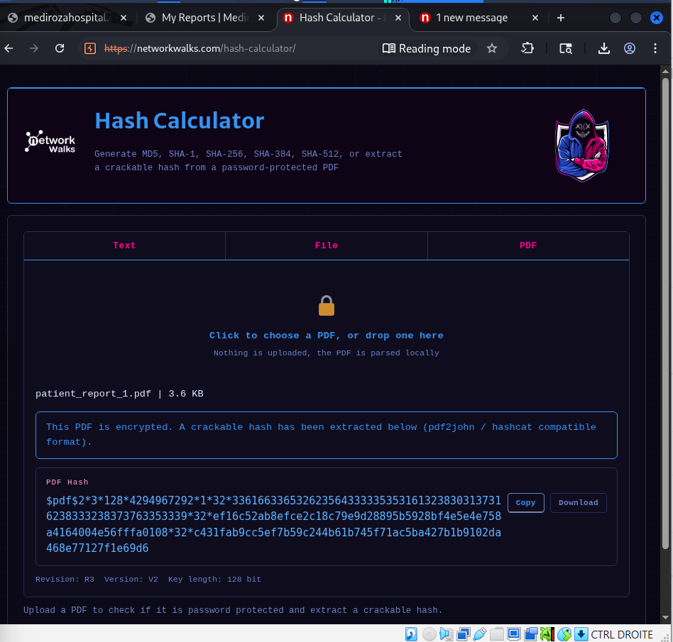
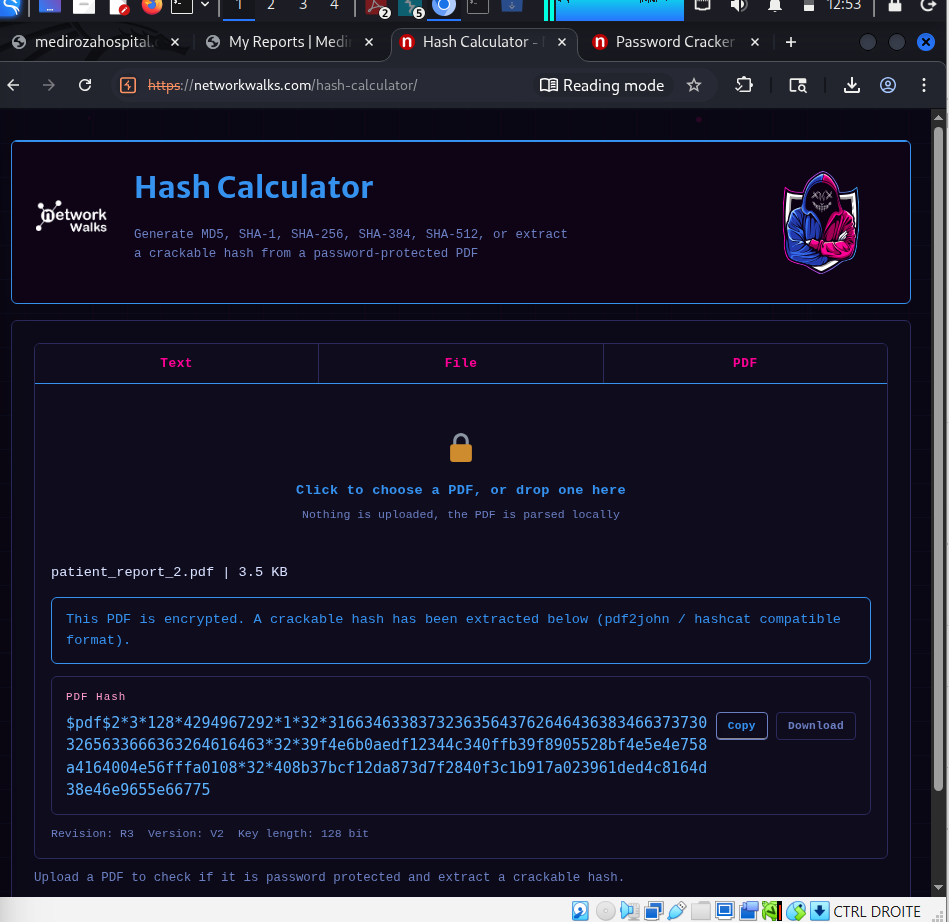
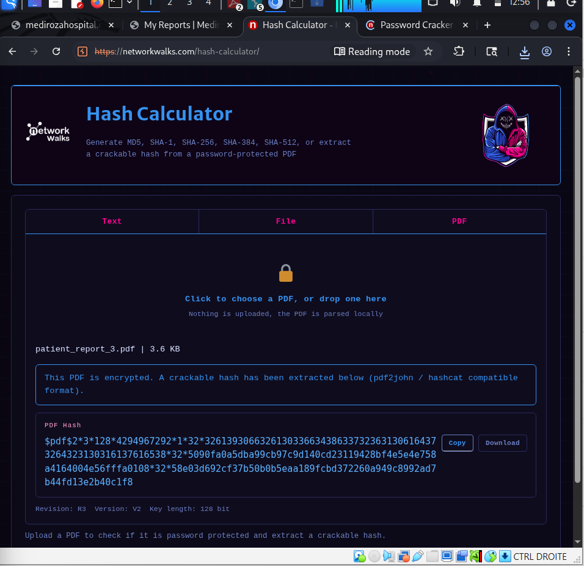
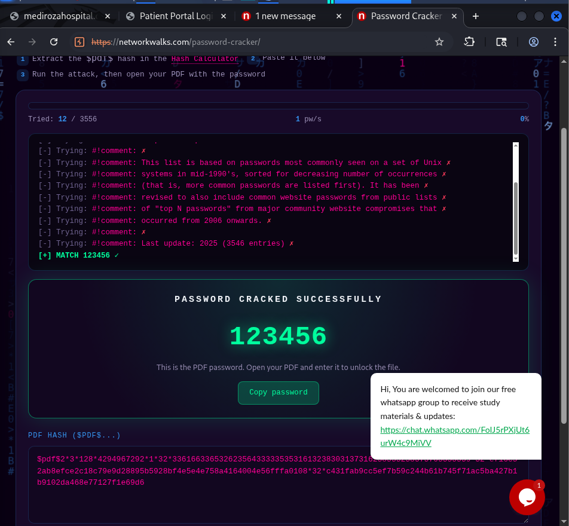
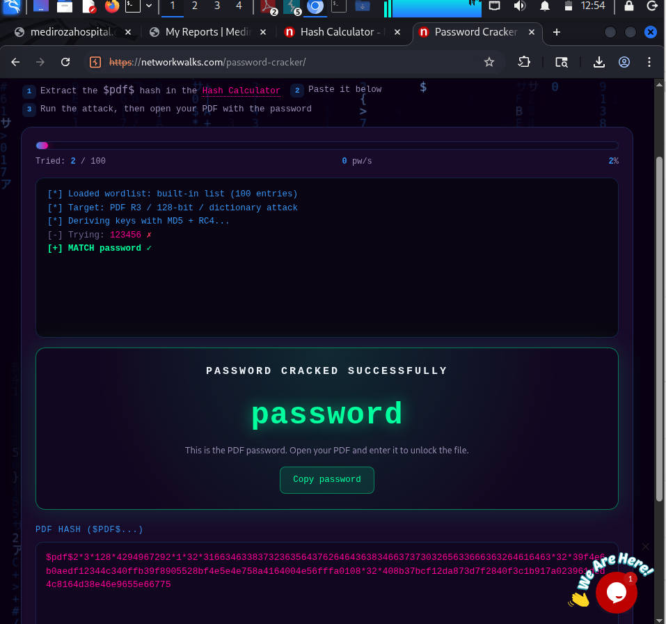
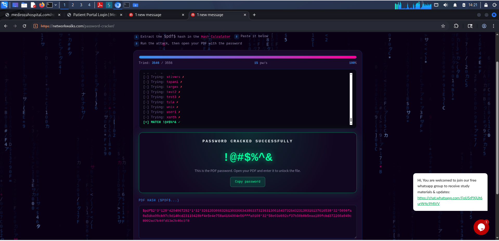
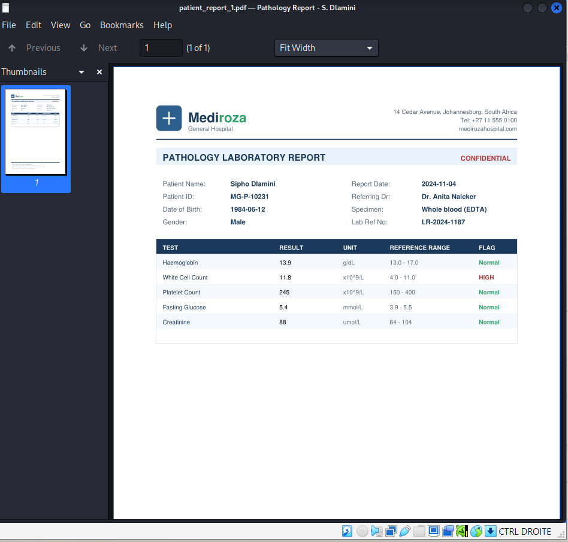
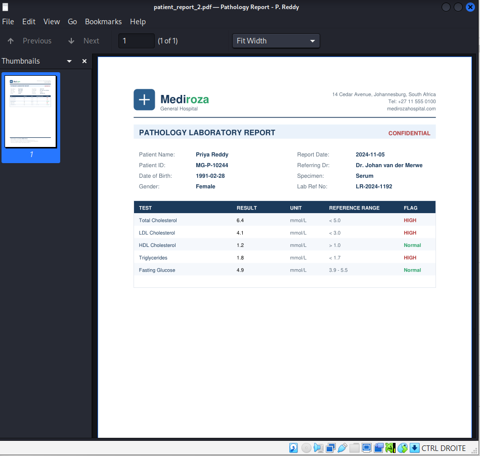
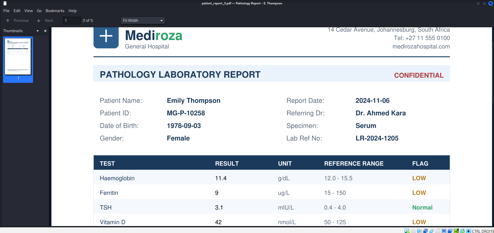

# M2 — DATA EXTRACTION

## 1. Objective

The objective of this milestone was to analyze the three PDF laboratory reports retrieved during **M1 — Initial Access**, identify their protection mechanisms, recover the passwords protecting the documents, and successfully decrypt the three reports.

The analysis was performed within the authorized Mediroza General Hospital educational environment.

---

# 2. Prerequisites

The three PDF reports retrieved during M1 were used as input for this milestone:

```text
report-01.pdf
report-02.pdf
report-03.pdf
```

The original files were preserved locally as evidence.

For privacy and security reasons, the original decrypted medical reports are **not included in this public repository**.

---

# 3. Methodology

The extraction process followed three main phases:

```text
Retrieved PDF
      │
      ▼
Hash Extraction
      │
      ▼
Password Recovery
      │
      ▼
PDF Decryption
      │
      ▼
Recovered Report
```

Each PDF was processed individually.

The third PDF required an additional adaptation because the initial hash-processing attempt indicated that a wordlist was required.

---

# 4. Hash Extraction

## 4.1 PDF 1 — Hash Extraction

The first retrieved PDF was processed to extract the information required for the subsequent password-recovery phase.

### Evidence



**Figure 1 — Hash extracted from the first PDF**

The resulting hash was subsequently used as input for the password-recovery process.

---

## 4.2 PDF 2 — Hash Extraction

The same procedure was applied to the second PDF.

### Evidence



**Figure 2 — Hash extracted from the second PDF**

The extracted hash was then processed during the password-recovery phase.

---

## 4.3 PDF 3 — Initial Hash Processing

The third PDF required an additional step.

During the initial processing attempt, the operation could not continue because a wordlist was required.

### Evidence


**Figure 3 — Initial processing attempt indicating that a wordlist was required**

This demonstrated that the same procedure could not be completed without providing the required input.

---

## 4.4 PDF 3 — Wordlist Provided

A suitable wordlist was subsequently provided and the process was executed again.

### Evidence



**Figure 4 — Wordlist provided and hash processing completed**

This allowed the third PDF to proceed to the password-recovery phase.

---

# 5. Password Recovery

After extracting the required hash information, each PDF was processed independently to recover its corresponding password.

The results were obtained for all three documents.

---

## 5.1 PDF 1 — Password Recovery

### Evidence



**Figure 5 — Password recovered for PDF 1**

The recovered password was then used to access the protected document.

---

## 5.2 PDF 2 — Password Recovery

### Evidence



**Figure 6 — Password recovered for PDF 2**

The recovered password was subsequently used to decrypt the second document.

---

## 5.3 PDF 3 — Password Recovery

### Evidence



**Figure 7 — Password recovered for PDF 3**

The recovered password allowed the third protected document to be accessed.

---

# 6. PDF Decryption

The recovered passwords were then used to open the three protected PDF documents.

---

## 6.1 PDF 1 — Decrypted Report

### Evidence



**Figure 8 — PDF 1 successfully decrypted**

The first protected document was successfully opened after password recovery.

---

## 6.2 PDF 2 — Decrypted Report

### Evidence



**Figure 9 — PDF 2 successfully decrypted**

The second protected document was successfully opened using its recovered password.

---

## 6.3 PDF 3 — Decrypted Report

### Evidence



**Figure 10 — PDF 3 successfully decrypted**

The third protected document was successfully opened after completing the adapted password-recovery process.

---

# 7. Results Summary

| Document | Hash Extraction      | Password Recovery | Decryption   |
| -------- | -------------------- | ----------------- | ------------ |
| PDF 1    | ✅ Successful         | ✅ Successful      | ✅ Successful |
| PDF 2    | ✅ Successful         | ✅ Successful      | ✅ Successful |
| PDF 3    | ⚠️ Wordlist required | ✅ Successful      | ✅ Successful |

The third document required an additional wordlist before the hash-processing operation could be completed.

This demonstrated the need to adapt the analysis according to the protection mechanism encountered rather than applying a single identical procedure to all documents.

---

# 8. Security Impact

The successful recovery of the passwords protecting the three laboratory reports demonstrates that the confidentiality of the documents depended on the strength of their password-based protection.

Once the passwords were recovered, the encrypted documents could be opened and their contents accessed.

In a real-world healthcare environment, inadequate protection of medical documents could expose highly sensitive patient information.

The original documents and their sensitive contents are therefore excluded from this public repository.

---

# 9. Evidence Structure

All screenshots associated with this milestone are stored in:

```text
M2-DATA-EXTRACTION/
│
├── README.md
│
├── screenshots/
│   ├── 01-hash-pdf-01.png
│   ├── 02-hash-pdf-02.png
│   ├── 03-hash-pdf-03-wordlist-required.png
│   ├── 04-hash-pdf-03-wordlist-loaded.png
│   ├── 05-password-crack-pdf-01.png
│   ├── 06-password-crack-pdf-02.png
│   ├── 07-password-crack-pdf-03.png
│   ├── 08-report-pdf-01-decrypted.png
│   ├── 09-report-pdf-02-decrypted.png
│   └── 10-report-pdf-03-decrypted.png
│
└── evidence/
```

---

# 10. Security and Privacy Notice

The retrieved laboratory reports may contain confidential medical and personally identifiable information.

Therefore:

* Original PDF files are not included in the public repository.
* Patient information should be redacted from screenshots.
* Passwords and sensitive credentials should not be exposed publicly.
* Evidence files containing confidential information should remain in the controlled local assessment environment.

---

# 11. Conclusion

### ✅ M2 — DATA EXTRACTION COMPLETED

The three PDF laboratory reports retrieved during M1 were successfully processed.

The assessment achieved the following objectives:

* [x] Three retrieved PDF documents analyzed
* [x] Hash information extracted
* [x] Password-recovery process performed
* [x] Additional wordlist provided for PDF 3 when required
* [x] Passwords recovered for all three documents
* [x] Three protected PDFs successfully decrypted
* [x] Evidence documented through screenshots

The information obtained during this milestone was subsequently used as part of **M3 — Critical Data Exposure**.
