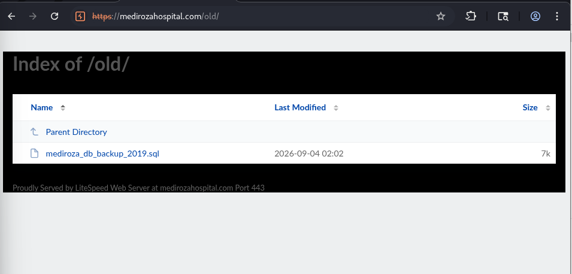
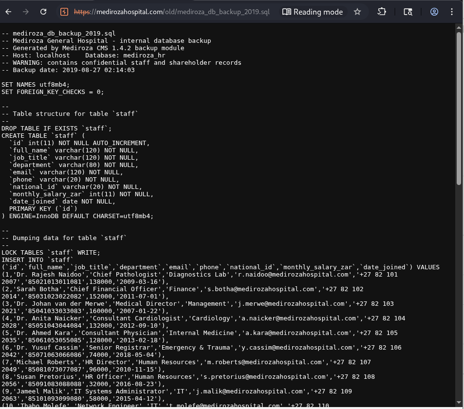
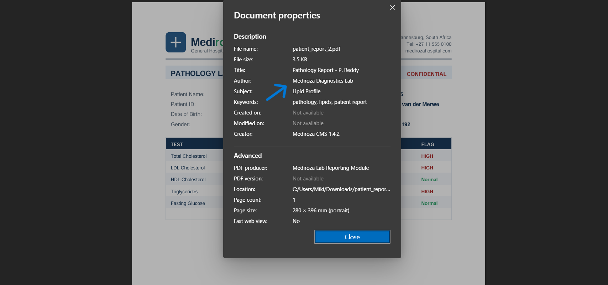
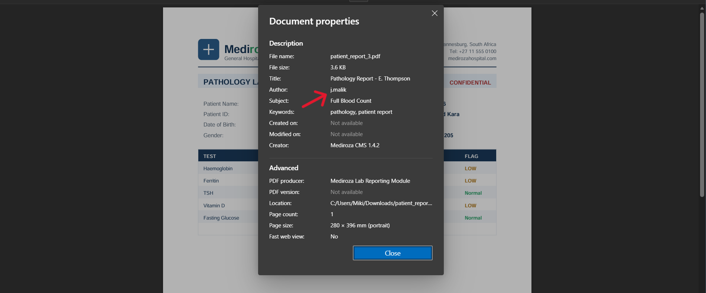

# M3 — CRITICAL DATA EXPOSURE

## 1. Objective

The objective of this module was to identify additional sensitive information exposed by the Mediroza General Hospital web application after obtaining access to the application during **M1 — Initial Access** and recovering the protected documents during **M2 — Data Extraction**.

The investigation focused on identifying exposed files, metadata, employee information, salary information, and shareholder information.

---

## 2. Scope

| Item            | Description                                |
| --------------- | ------------------------------------------ |
| Target          | `https://medirozahospital.com`             |
| Assessment Type | Black-box Web Application Penetration Test |
| Module          | M3 — Critical Data Exposure                |
| Batch           | B083                                       |
| Duration        | 5 Days                                     |
| Authorization   | Authorized educational security assessment |

All testing activities were conducted exclusively against the authorized Mediroza General Hospital laboratory target.

---

## 3. Investigation Process

The M3 investigation followed this general process:

```text
Previously Identified Web Resources
              ↓
        /old/ Directory
              ↓
      Exposed Information
              ↓
      Metadata Analysis
              ↓
 Identification of Sensitive Data
              ↓
 Salary & Shareholder Information
```

The investigation was performed in a black-box manner, using the information and resources exposed by the target application.

---

# 4. Identification of the `/old/` Directory

During the reconnaissance and enumeration phase, the `/old/` directory was identified as an accessible resource.



**Figure 1 — Identification of the `/old/` directory**

The presence of an accessible directory containing older application resources represented an additional attack surface.

Directories intended for historical, temporary, or backup resources should not remain publicly accessible when they contain sensitive application information.

---

# 5. Discovery of Exposed Data

Further examination of the exposed resources led to the identification of sensitive information.



**Figure 2 — Exposed sensitive data**

The exposed information included data related to hospital personnel and organizational information.

The investigation specifically identified:

* Salary information for hospital employees.
* Information concerning the hospital's shareholders.
* Additional metadata associated with the exposed resources.

This represents a significant confidentiality issue because information that should normally be restricted to authorized personnel was accessible through the exposed resources.

---

# 6. Metadata Analysis

## 6.1 Normal Author Metadata

Metadata associated with one of the analyzed resources was examined to understand the information disclosed by the document.



**Figure 3 — Metadata showing the normal author information**

The metadata analysis demonstrated that document properties can reveal additional information beyond the visible content of a file.

Metadata should therefore be considered part of the application's potential information-disclosure surface.

---

## 6.2 Anomalous Metadata — JMalik

A second metadata analysis revealed an anomalous author value associated with **JMalik**.



**Figure 4 — Metadata anomaly associated with JMalik**

This observation demonstrates that document metadata may contain information that can help an attacker understand the origin, creation, or handling of files.

Even when metadata does not directly provide authentication credentials, it can contribute to information disclosure and reconnaissance.

---

# 7. Sensitive Information Identified

The investigation confirmed the exposure of two major categories of sensitive organizational information.

### 7.1 Employee Salary Information

The exposed resources contained salary information concerning the hospital's employees.

For privacy and ethical reasons, the actual employee names and salary values are **not reproduced in this public repository**.

### 7.2 Shareholder Information

The investigation also identified information concerning the hospital's shareholders.

The actual shareholder identities and associated sensitive information are **not reproduced in this public repository**.

Sensitive evidence should remain in the authorized assessment environment or in a secured private evidence repository.

---

# 8. Security Impact

The exposure identified during this module could have several security and privacy consequences.

### Confidentiality

Unauthorized users could potentially access information that should be restricted, including employee salary information and shareholder-related information.

### Privacy

Employee-related information represents sensitive personal information and should be protected against unauthorized disclosure.

### Organizational Intelligence

Shareholder information can reveal details about the organization's ownership structure.

### Information Disclosure

Document metadata may expose information about document authors or the origin of files.

### Attack Surface Expansion

The availability of an `/old/` directory demonstrates that historical or obsolete resources can create additional exposure when they remain accessible from the web application.

---

# 9. Evidence Summary

| Evidence                         | Observation                           | Security Impact                   |
| -------------------------------- | ------------------------------------- | --------------------------------- |
| `01-old-directory.png`           | `/old/` directory identified          | Additional exposed attack surface |
| `02-exposed-data.png`            | Sensitive organizational data exposed | Confidentiality and privacy risk  |
| `03-metadata-normal-author.png`  | Author metadata identified            | Information disclosure            |
| `04-metadata-jmalik-anomaly.png` | Anomalous author metadata identified  | Additional information disclosure |

---

# 10. Key Findings

Based on the M3 investigation, the following security issues were identified:

### Finding 1 — Exposure of sensitive organizational information

Sensitive employee and organizational information was accessible through exposed web resources.

### Finding 2 — Exposure of employee salary information

Salary information concerning hospital employees was identified within the exposed data.

### Finding 3 — Exposure of shareholder information

Information concerning the hospital's shareholders was identified within the exposed data.

### Finding 4 — Metadata information disclosure

Document metadata exposed author-related information, including an anomalous metadata value associated with JMalik.

### Finding 5 — Accessible historical resources

The `/old/` directory was accessible and contributed to the discovery of additional information.

---

# 11. Recommended Remediation

The following remediation measures are recommended:

### 11.1 Remove sensitive files from the web root

Sensitive documents, database exports, backups, and historical files should not be stored in publicly accessible web directories.

### 11.2 Disable unnecessary directory listing

Directory indexing should be disabled so that users cannot browse the contents of application directories.

### 11.3 Apply strict access control

Sensitive employee, financial, and organizational information should only be accessible to explicitly authorized users.

### 11.4 Remove unnecessary metadata

Before publishing or distributing documents, unnecessary metadata should be removed where appropriate.

### 11.5 Implement secure backup management

Application backups should be stored outside the web-accessible directory and protected by appropriate access controls.

### 11.6 Perform regular exposure assessments

Security teams should periodically review publicly accessible resources for:

* Forgotten files
* Old directories
* Backups
* Temporary files
* Debug files
* Sensitive documents
* Metadata leaks

---

# 12. Privacy and Evidence Handling

The information discovered during this assessment includes potentially sensitive employee and organizational data.

Therefore:

* Original sensitive files are **not included in this public GitHub repository**.
* Employee names and salary values are not reproduced.
* Shareholder information is not reproduced.
* Credentials and other authentication information are not published.
* Screenshots containing sensitive information should be redacted before publication.
* Original evidence should be preserved securely for the authorized assessment.

The screenshots included in this repository are intended only to document the technical findings of the authorized laboratory exercise.

---

# 13. Conclusion

The M3 investigation demonstrated that the security exposure extended beyond the initial access obtained during M1.

The identification of the `/old/` directory led to the discovery of additional exposed information, including **employee salary information and shareholder information**. Metadata analysis also revealed author-related information and an anomaly associated with JMalik.

These observations demonstrate the importance of securing not only the application's authentication mechanisms, but also its file storage, historical resources, document metadata, access controls, and backup management.

The findings identified during M3 will be consolidated with the results from M1 and M2 in **M4 — Pentest Report**, where the vulnerabilities will be formally documented, risk-rated, and accompanied by remediation recommendations.

---

## Evidence Structure

```text
M3-CRITICAL-DATA-EXPOSURE/
├── README.md
├── screenshots/
│   ├── 01-old-directory.png
│   ├── 02-exposed-data.png
│   ├── 03-metadata-normal-author.png
│   └── 04-metadata-jmalik-anomaly.png
└── evidence/
```

---

**Module:** M3 — Critical Data Exposure
**Project:** Penetration Testing Project — Mediroza General Hospital
**Batch:** B083
**Author:** Nelly
